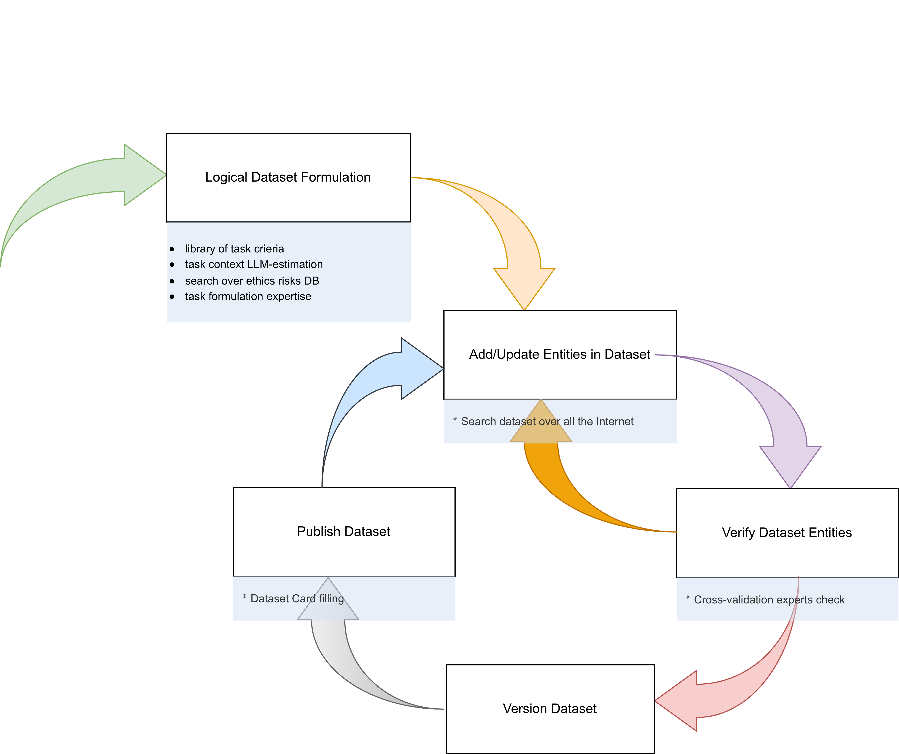

# kappa-apk

[](https://github.com/nsu-ai/kappa/blob/main/LICENSE.md)

[](https://pepy.tech/projects/kappa-apk)


Python client SDK for **Kappa-framework** — a self-hosted microservices platform for ML/AI research workflows.

Built with Rust + [PyO3](https://pyo3.rs), distributed as the `kappa_apk` Python package.

**Full SDK documentation:** [`docs/README.md`](docs/README.md) (EN) · [`docs/ru/README.md`](docs/ru/README.md) (RU) | **Русская версия:** [`README.md`](README.md)

| | |
|---|---|
| **Version** | 3.0.1 |
| **Python** | 3.9+ |
| **Rust edition** | 2024 |
| **License** | BSD-3-Clause ([LICENSE.md](LICENSE.md)) |

---

# Kappa — ϰ-framework for dataset and model management, version 3.0.1

Kappa is a conceptual and software framework for dataset curation and model lifecycle management, developed at the [AI Research Center](https://nsu.ru/n/ai-center) for Construction and Urban Environment, Novosibirsk State University.

## Authors

Kumar R., Pavlovsky E.N., Ivankov P.S., Denisov S.S., Mishchenko A.S., Bolotov K.Yu., Bezrukov Ya.S., Glushchenko A.V., Derbal R., Bobo S.

## Purpose

* Distribute responsibility when building datasets;
* Monitor ML model training with feedback loops on the dataset;
* Test digital twins powered by AI models;
* Track compliance with ethical norms and standards.



## Features

* [Implemented 2024, v1.0.0] Annotation authorship tracking, including automated labeling tools
* [Implemented 2025, v2.0.0] AI model benchmarking
* [Planned 2026] Index datasets and AI tasks from scientific publications and open-source code (construction and urban environment domain)

## Projects built on the framework

* 05-2024 – 11-2024: [Database](https://ai.nsu.ru/dv/) for the ["Schoolchildren — scientific volunteers"](https://syncwoia.com/event/datavolunteers) project
* 12-2024 – present: [Deployed framework with datasets](https://kappa.nsu.ru:8060/user-micro-services/v2/docs) — download the [bibliographic card dataset](#datasets) used for OCR training in the construction domain

## Funding

**2024:** This work was supported by a grant for research centers, provided by the Analytical Center for the Government of the Russian Federation in accordance with the subsidy agreement (agreement identifier 000000D730324P540002) and the agreement with the Novosibirsk State University dated December 27, 2023 No. 70-2023-001318.

**2025:** Research carried out under federal budget grant agreement No. 139-15-2025-006 (IGK 000000Ц313925P3S0002), AI direction "Construction and Urban Environment", NSU AI Research Center activity plan item No. 56.

**2026:** Research carried out under federal budget grant agreement No. 139-15-2025-006 (IGK 000000Ц313925P3S0002), AI direction "Construction and Urban Environment", NSU AI Research Center activity plan item No. 85.

## Datasets

Three datasets are registered on the framework:

* "Dataset for retroconversion of library cards (construction)" — database registration certificate No. 2025620303, January 17, 2025
* "Dataset for flora and fauna observations in urban environments" — database registration certificate No. 2025620139, January 10, 2025
* "Dataset for extracting annotations from library resources" — database registration certificate No. 2026620302, January 21, 2026

---

# kappa-apk installation

## Requirements

- Python 3.9+
- For building from source: Rust toolchain + `maturin >= 1.9`

## Installation

### From PyPI (recommended)

```bash
pip install kappa-apk
```

Pre-built wheels are published for **Linux (manylinux)**, **macOS** (Intel + Apple Silicon), and **Windows**, for Python **3.9–3.13**.

```python
import kappa_apk
print(kappa_apk.version())
```

### From source (requires Rust)

```bash
pip install maturin
git clone https://github.com/nsu-ai/kappa.git
cd kappa
maturin develop --release
```

### Local wheel build

```bash
# Local build only → dist/ (no upload)
./build_wheel.sh
./build_wheel.sh --local --no-sdist -v 3.11

# Build + install + smoke test
./build_wheel.sh -i

# Build + upload to PyPI
./build_wheel.sh --upload
```

### Build requirements

- Rust toolchain (`curl https://sh.rustup.rs | sh`)
- `maturin >= 1.9` (`pip install maturin`)
- Python 3.9–3.13
- Optional: `cibuildwheel` for cross-platform wheels (see [`docs/BuildAndPublish.md`](docs/BuildAndPublish.md))

---

## Getting Started

All requests go through the **Traefik API gateway** — set `base_url` to the gateway host. Identity (user, org) is derived from the JWT token server-side; no user IDs in URLs.

```python
from kappa_apk import KappaApkClient

base_url = "https://kappa.nsu.ru:8061"

# Connect via context manager (auto login/logout)
with KappaApkClient(base_url, "user@example.com", "secret") as client:

    # List datasets
    page = client.list_datasets(size=50)
    print(page["items"])

    # Download a dataset version archive (cached on disk)
    info = client.download_dataset_version_archive(
        dataset_id=582,
        version_no="1.0.0",
    )
    print(info.data_path)   # ~/cache/kappa-framework/datasets/...

    # Or load directly into a data loader for training
    loader = client.get_dataset_loader(
        dataset_name="MyDataset",
        version_no="1.0.0",
        batch_size=32,
        shuffle=True,
    )
    for batch in loader:
        print(batch[0]["entity_id"])
```

### Core concepts

| Concept | Description |
|---|---|
| `KappaApkClient` | Main HTTP client — auth, datasets, benchmarks |
| `KappaDataset` | In-memory dataset (`__len__` / `__getitem__`) |
| `KappaDataLoader` | Epoch-aware Rust batch loader |
| `vision` / `text` / `audio` | Transform submodules for preprocessing |

---

## Documentation

**English** · **Русский:** [`README.md`](README.md) · [`docs/ru/`](docs/ru/)

| Guide (EN) | Guide (RU) | Description |
|---|---|---|
| [`docs/GettingStarted.md`](docs/GettingStarted.md) | [`docs/ru/GettingStarted.md`](docs/ru/GettingStarted.md) | Install, gateway, authentication |
| [`docs/KappaApkClient.md`](docs/KappaApkClient.md) | [`docs/ru/KappaApkClient.md`](docs/ru/KappaApkClient.md) | Client API reference |
| [`docs/Datasets.md`](docs/Datasets.md) | [`docs/ru/Datasets.md`](docs/ru/Datasets.md) | Dataset CRUD, entities, versions |
| [`docs/LoadersAndTransforms.md`](docs/LoadersAndTransforms.md) | [`docs/ru/LoadersAndTransforms.md`](docs/ru/LoadersAndTransforms.md) | Data loaders and transforms |
| [`docs/Benchmarks.md`](docs/Benchmarks.md) | [`docs/ru/Benchmarks.md`](docs/ru/Benchmarks.md) | Benchmark workflow |
| [`docs/DataModels.md`](docs/DataModels.md) | [`docs/ru/DataModels.md`](docs/ru/DataModels.md) | Request/response models |
| [`docs/BuildAndPublish.md`](docs/BuildAndPublish.md) | [`docs/ru/BuildAndPublish.md`](docs/ru/BuildAndPublish.md) | Wheels, CI, PyPI publishing |
| [`code_examples/`](code_examples/) | — | Runnable usage examples |

---

## License

See [LICENSE.md](LICENSE.md) — BSD 3-Clause License, Copyright (c) 2024, Novosibirsk State University, Ai-Center.
