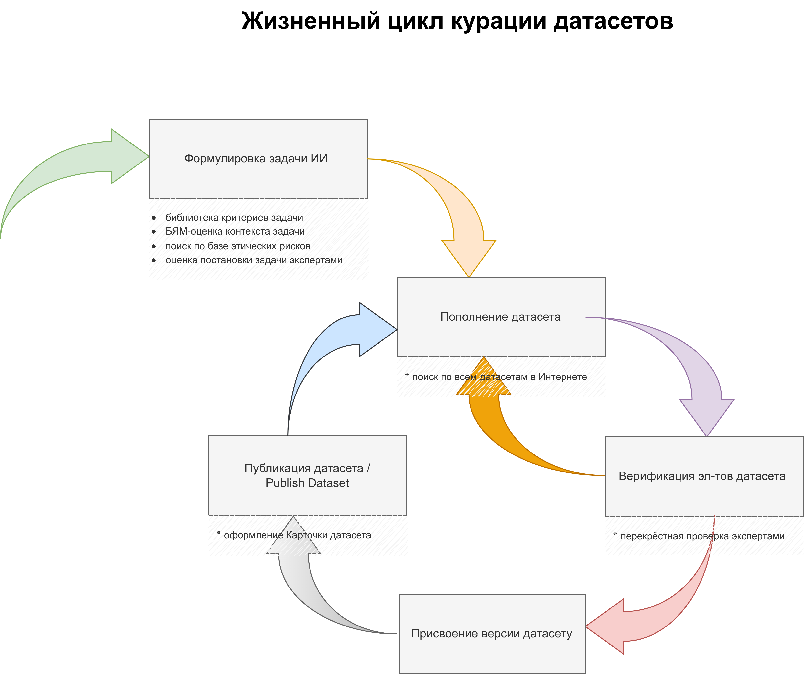

# Kappa - ϰ-framework for curating datasets and models
КАППА - Фреймворк курации датасетов и моделей
(Центр ИИ НГУ, Новосибирск)

## Назначение:

* Распределение ответственности при формировании набора данных;
* Контроль за обучением моделей машинного обучения с обратной связью на датасет;
* Испытание цифровых двойников на базе моделей искусственного интеллекта;
* Отслеживание соблюдения этических норм и стандартов

## Функции:

* Отслеживание авторства  разметки, в т.ч. использованием средств автоматизации разметки
* Индексация всех датасетов в интернете (для сферы строительства и городской среды)
* Индексация всех ИИ-задач, из научных публикаций и открытых кодов (для сферы строительства и городской среды)

# Проекты на базе фреймворка

* 05-2024 - 11-2024: [База данных](https://ai.nsu.ru/product/) для проекта ["Школьники - научные волонтёры"](https://syncwoia.com/event/datavolunteers)

## Финансовая поддержка

Исследование выполнено за счет финансовой поддержки (гранта) исследовательских
центров, предоставленной Автономной некоммерческой организацией
«Аналитический центр при Правительстве Российской Федерации», идентификатор
соглашения о предоставлении субсидии 000000D730324P540002, договор о
предоставлении гранта с Новосибирским государственным университетом от
27.12.2023 № 70-2023-001318.
