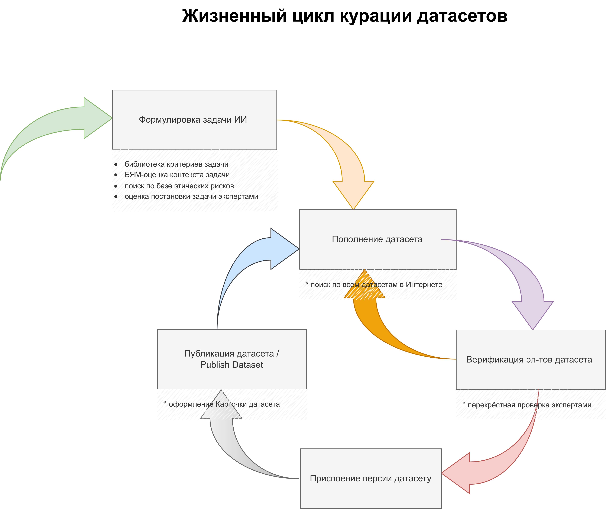

# kf-sdk (`import kappa_apk`)

[](https://github.com/nsu-ai/kappa/blob/main/LICENSE.md)

[](https://pypi.org/project/kf-sdk/)


Python-клиент SDK для **Kappa-framework** — самостоятельно развёртываемой микросервисной платформы для исследовательских ML/AI рабочих процессов.

Реализован на Rust + [PyO3](https://pyo3.rs). **PyPI:** `kf-sdk` · **импорт:** `import kappa_apk` (имя дистрибутива сохранено для совместимости с ранними публикациями).

**Документация SDK:** [`docs/ru/README.md`](docs/ru/README.md) (RU) · [`docs/README.md`](docs/README.md) (EN) | **English version:** [`README.en.md`](README.en.md)

| | |
|---|---|
| **Версия** | 3.0.2 |
| **Требует Kappa** | **≥ 2.10.0** (`min_backend_version()`) |
| **Python** | 3.9+ |
| **Rust edition** | 2024 |
| **Лицензия** | BSD-3-Clause ([LICENSE.md](LICENSE.md)) |

---

# Каппа — ϰ-фреймворк управления датасетами и моделями, версия 3.0.2

Каппа — набор концептуального и программного обеспечения (фреймворк) для осуществления функций курации датасетов и моделей ([Исследовательский центр](https://nsu.ru/n/ai-center) в сфере искусственного интеллекта по направлению «Строительство и городская среда» НГУ, Новосибирск).

## Авторы

Кумар Р., Павловский Е.Н., Иванков П.С., Денисов С.С., Мищенко А.С., Болотов К.Ю., Безруков Я.С., Глушенко А.В., Дербаль Р., Бобо С.

## Назначение

* Распределение ответственности при формировании набора данных;
* Контроль за обучением моделей машинного обучения с обратной связью на датасет;
* Испытание цифровых двойников на базе моделей искусственного интеллекта;
* Отслеживание соблюдения этических норм и стандартов.



## Функции

* [Реализовано в 2024, версия 1.0.0] Отслеживание авторства разметки, в т.ч. с использованием средств автоматизации разметки
* [Реализовано в 2025, версия 2.0.0] Бенчмаркинг ИИ-моделей
* [План на 2026] Индексация всех датасетов в интернете (для сферы строительства и городской среды), индексация всех ИИ-задач из научных публикаций и открытых кодов (для сферы строительства и городской среды)

## Проекты на базе фреймворка

* 05-2024 – 11-2024: [База данных](https://ai.nsu.ru/dv/) для проекта [«Школьники — научные волонтёры»](https://syncwoia.com/event/datavolunteers)
* 12-2024 – н.в.: [Развёрнутая версия фреймворка с датасетами](https://kappa.nsu.ru:8060/user-micro-services/v2/docs) — здесь можно скачать [датасет библиографических карточек](#датасеты), используемый для обучения алгоритмов распознавания текста на изображениях в строительной тематике

## Финансовая поддержка

**2024:** Исследование выполнено за счёт финансовой поддержки (гранта) исследовательских центров, предоставленной Автономной некоммерческой организацией «Аналитический центр при Правительстве Российской Федерации», идентификатор соглашения о предоставлении субсидии 000000D730324P540002, договор о предоставлении гранта с Новосибирским государственным университетом от 27.12.2023 № 70-2023-001318.

**2025:** Исследование выполнено в рамках гранта (Соглашение о предоставлении из федерального бюджета гранта в форме субсидии от 17.04.2025 № 139-15-2025-006 ИГК 000000Ц313925P3S0002), направление «Строительство и городская среда», мероприятие № 56 Плана деятельности Исследовательского центра в сфере ИИ НГУ.

**2026:** Исследование выполнено в рамках гранта (Соглашение о предоставлении из федерального бюджета гранта в форме субсидии от 17.04.2025 № 139-15-2025-006 ИГК 000000Ц313925P3S0002), направление «Строительство и городская среда», мероприятие № 85 Плана деятельности Исследовательского центра в сфере ИИ НГУ.

## Датасеты

На базе фреймворка зарегистрировано три датасета:

* «Датасет по ретроконверсии библиотечных карточек (строительство)» — свидетельство о регистрации базы данных № 2025620303 от 17 января 2025 г.
* «Датасет по наблюдениям за флорой и фауной в городской среде» — свидетельство о регистрации базы данных № 2025620139 от 10 января 2025 г.
* «Датасет по извлечению аннотаций из библиотечных ресурсов» — свидетельство о регистрации базы данных № 2026620302 от 21 января 2026 г.

---

# Установка (`kf-sdk` / `kappa_apk`)

## Требования

- Python 3.9+
- Для сборки из исходников: Rust toolchain + `maturin >= 1.9`

## Установка

### Из PyPI (рекомендуется)

```bash
pip install kf-sdk
```

Сборки wheels публикуются для **Linux (manylinux)**, **macOS** (Intel + Apple Silicon) и **Windows**, Python **3.9–3.13**.

```python
import kappa_apk
print(kappa_apk.version())
```

### Из исходников (требуется Rust)

```bash
pip install maturin
git clone https://github.com/nsu-ai/kappa.git
cd kappa
maturin develop --release
```

### Локальная сборка wheel

```bash
# Только локальная сборка → dist/ (без загрузки)
./build_wheel.sh
./build_wheel.sh --local --no-sdist -v 3.11

# Сборка + установка + smoke test
./build_wheel.sh -i

# Сборка + загрузка на PyPI
./build_wheel.sh --upload
```

### Требования для сборки

- Rust toolchain (`curl https://sh.rustup.rs | sh`)
- `maturin >= 1.9` (`pip install maturin`)
- Python 3.9–3.13
- Опционально: `cibuildwheel` для кроссплатформенных wheels (см. [`docs/ru/BuildAndPublish.md`](docs/ru/BuildAndPublish.md))

---

## Начало работы

Все запросы идут через **шлюз Traefik API** — укажите `base_url` как адрес шлюза. Идентификация (пользователь, организация) определяется JWT-токеном на стороне сервера; идентификаторы пользователей в URL не передаются.

```python
from kappa_apk import KappaApkClient

base_url = "https://kappa.nsu.ru:8061"

# Подключение через контекстный менеджер (автоматический вход/выход)
with KappaApkClient(base_url, "user@example.com", "secret") as client:

    # Список датасетов
    page = client.list_datasets(size=50)
    print(page["items"])

    # Загрузка архива версии датасета (кэшируется на диске)
    info = client.download_dataset_version_archive(
        dataset_id=582,
        version_no="1.0.0",
    )
    print(info.data_path)   # ~/cache/kappa-framework/datasets/...

    # Или загрузка напрямую в загрузчик данных для обучения
    loader = client.get_dataset_loader(
        dataset_name="MyDataset",
        version_no="1.0.0",
        batch_size=32,
        shuffle=True,
    )
    for batch in loader:
        print(batch[0]["entity_id"])
```

### Основные понятия

| Понятие | Описание |
|---|---|
| `KappaApkClient` | Основной HTTP-клиент — аутентификация, датасеты, бенчмарки |
| `KappaDataset` | Датасет в памяти (`__len__` / `__getitem__`) |
| `KappaDataLoader` | Пакетный загрузчик на Rust с учётом эпох |
| `vision` / `text` / `audio` | Подмодули преобразований для предобработки |

---

## Документация

**Русский** · **English:** [`README.en.md`](README.en.md) · [`docs/README.md`](docs/README.md)

| Руководство (RU) | Руководство (EN) | Описание |
|---|---|---|
| [`docs/ru/GettingStarted.md`](docs/ru/GettingStarted.md) | [`docs/GettingStarted.md`](docs/GettingStarted.md) | Установка, шлюз, аутентификация |
| [`docs/ru/KappaApkClient.md`](docs/ru/KappaApkClient.md) | [`docs/KappaApkClient.md`](docs/KappaApkClient.md) | Справочник API клиента |
| [`docs/ru/Datasets.md`](docs/ru/Datasets.md) | [`docs/Datasets.md`](docs/Datasets.md) | CRUD датасетов, сущности, версии |
| [`docs/ru/LoadersAndTransforms.md`](docs/ru/LoadersAndTransforms.md) | [`docs/LoadersAndTransforms.md`](docs/LoadersAndTransforms.md) | Загрузчики данных и преобразования |
| [`docs/ru/Benchmarks.md`](docs/ru/Benchmarks.md) | [`docs/Benchmarks.md`](docs/Benchmarks.md) | Рабочий процесс бенчмарков |
| [`docs/ru/DataModels.md`](docs/ru/DataModels.md) | [`docs/DataModels.md`](docs/DataModels.md) | Модели запросов и ответов |
| [`docs/ru/BuildAndPublish.md`](docs/ru/BuildAndPublish.md) | [`docs/BuildAndPublish.md`](docs/BuildAndPublish.md) | Wheels, CI, публикация на PyPI |
| [`code_examples/`](code_examples/) | — | Запускаемые примеры |

---

## Лицензия

См. [LICENSE.md](LICENSE.md) — BSD 3-Clause License, Copyright (c) 2024, Novosibirsk State University, Ai-Center.
